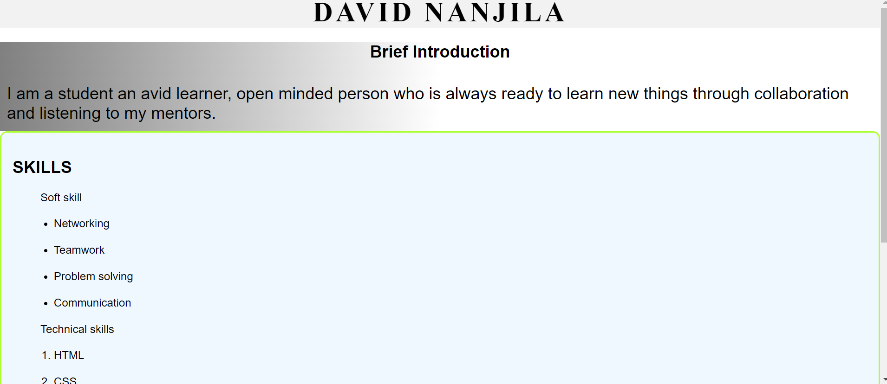
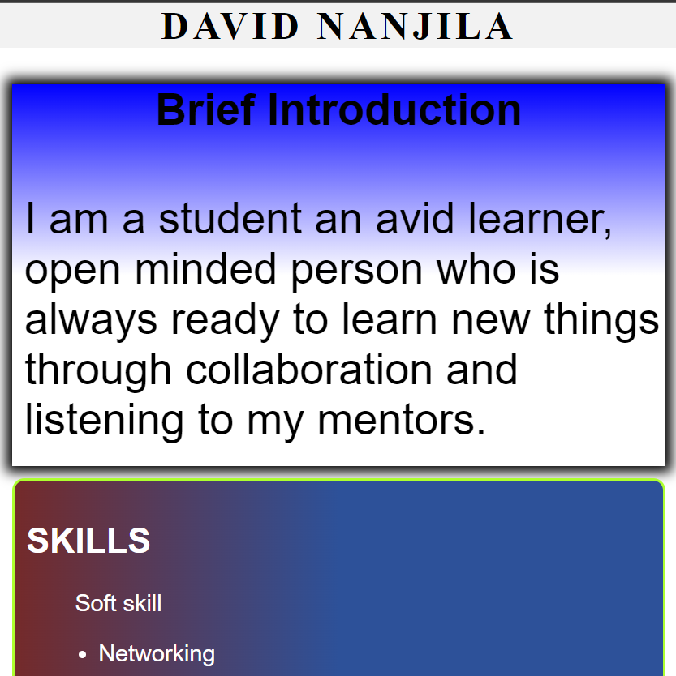

# CSS, Margin and padding feature
- This assignment is meant to test my understanding of the above features
- It also test the use of media queries to achieve web responsiveness

## technology used
- CSS and HTML

-  this is the output on full screen

- This is the ouput when you resize the screen
